# 🏪 Système de Gestion de Facturation - Architecture Microservices

## 📋 Description du Projet
Application de gestion de facturation basée sur une architecture microservices, développée avec Spring Boot et Spring Cloud. Le système permet de gérer des clients, des produits et des factures de manière distribuée et évolutive.

**Objectif :** Créer une application basée sur une architecture micro-service qui permet de gérer les factures contenant des produits et appartenant à un client.

**Ressources :**
- Partie 1 : https://www.youtube.com/watch?v=fvEg8bOhpo8
- Partie 2 : https://www.youtube.com/watch?v=yCFSatdQUmE
- Partie 3 : https://www.youtube.com/watch?v=-G2rcLMO1gQ

## 🏗️ Architecture du Projet

### Microservices
1. **customer-service** : Gestion des clients
   - CRUD des clients
   - API REST pour les opérations client
   - Utilisation de Spring Data REST
   - Projections personnalisées

2. **inventory-service** : Gestion des produits
   - CRUD des produits
   - Gestion du stock
   - Spring Data REST pour l'exposition des données

3. **billing-service** : Gestion des factures
   - Création et gestion des factures
   - Intégration avec customer-service et inventory-service via OpenFeign
   - Gestion des éléments de facture (ProductItem)

4. **gateway-service** : Spring Cloud Gateway
   - Routage statique et dynamique des requêtes
   - Gestion des CORS
   - Load balancing

5. **discovery-service** : Eureka Discovery Service
   - Découverte automatique des services
   - Gestion des instances de microservices

6. **config-service** : Service de configuration centralisée
   - Configuration externe des microservices
   - Gestion des profils (dev, prod)
   - Repository Git pour les configurations

## 🛠️ Technologies Utilisées

- **Backend**:
  - Java 21
  - Spring Boot 3.x
  - Spring Cloud (Gateway, Eureka, Config)
  - OpenFeign
  - Spring Data JPA
  - Spring Data REST
  - H2 Database (développement)
  - PostgreSQL (production)

- **Outils**:
  - Maven
  - Git
  - Docker (optionnel)

## 🚀 Installation et Démarrage

### Prérequis
- JDK 21
- Maven 3.6+
- PostgreSQL (pour la production)
- Docker (optionnel)

### Configuration
1. Cloner le dépôt :
   ```bash
   git clone https://github.com/YoussoufHard/ecom-microservices-app.git
   cd ecom-microservices-app
   ```

2. Démarrer les services dans l'ordre :
   ```bash
   # 1. Service de configuration
   cd config-service
   mvn spring-boot:run

   # 2. Service Eureka (discovery-service)
   cd ../discovery-service
   mvn spring-boot:run

   # 3. Autres services (dans l'ordre) :
   # customer-service
   # inventory-service
   # billing-service
   # gateway-service
   ```

### Ordre de Démarrage Recommandé
1. **discovery-service** (port: 8761)
2. **config-service** (port: 8888)
3. **customer-service** (port: 8081)
4. **inventory-service** (port: 8082)
5. **billing-service** (port: 8083)
6. **gateway-service** (port: 8080)

## 📚 Documentation des API

### Customer Service (Port: 8081)
- `GET /customers` - Lister tous les clients (Spring Data REST)
- `GET /customers/{id}` - Obtenir un client par ID
- `POST /customers` - Créer un nouveau client
- `PUT /customers/{id}` - Mettre à jour un client
- `DELETE /customers/{id}` - Supprimer un client
- `GET /customers/search/findByName?name={name}` - Recherche par nom
- `GET /customers/projections/email` - Projection email des clients

### Inventory Service (Port: 8082)
- `GET /products` - Lister tous les produits (Spring Data REST)
- `GET /products/{id}` - Obtenir un produit par ID
- `POST /products` - Créer un nouveau produit
- `PUT /products/{id}` - Mettre à jour un produit
- `DELETE /products/{id}` - Supprimer un produit
- `GET /products/search/findByName?name={name}` - Recherche par nom

### Billing Service (Port: 8083)
- `GET /bills` - Lister toutes les factures
- `GET /bills/{id}` - Obtenir une facture par ID
- `POST /bills` - Créer une nouvelle facture
- `GET /bills/customer/{customerId}` - Obtenir les factures d'un client

### Gateway Service (Port: 8080)
- Routes dynamiques vers tous les microservices
- `/CUSTOMER-SERVICE/**` -> customer-service
- `/INVENTORY-SERVICE/**` -> inventory-service
- `/BILLING-SERVICE/**` -> billing-service

### Config Service (Port: 8888)
- `GET /customer-service/default` - Configuration par défaut
- `GET /customer-service/dev` - Configuration développement
- `GET /customer-service/prod` - Configuration production

## 🧪 Tests
Pour exécuter les tests :
```bash
mvn test
```

## 📊 Schéma de la Base de Données
Le schéma de la base de données sera disponible dans le dossier `docs/`.

## 📋 Rapport Détaillé du Projet

### 1. Création du micro-service customer-service
**Objectif :** Développer un service dédié à la gestion des clients avec Spring Data REST.

**Fonctionnalités implémentées :**
- CRUD complet des clients
- Exposition des données via Spring Data REST
- Projections personnalisées (CustomerProjection, CustomerProjectionEmail)
- Base de données H2 pour le développement

**Captures d'écran :**
- 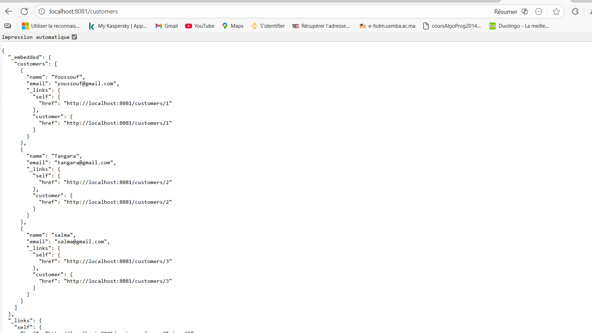
- 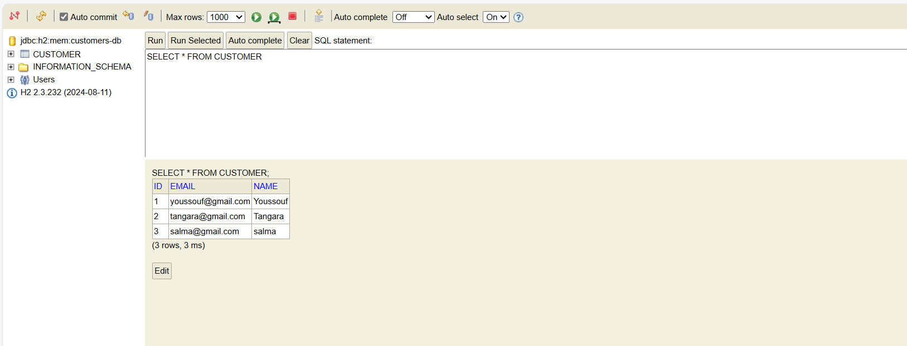
- 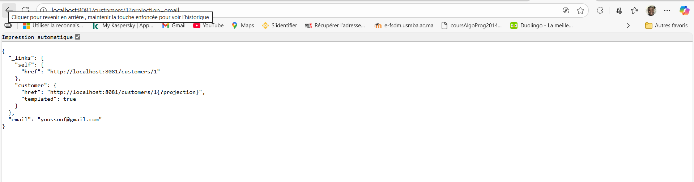

### 2. Création du micro-service inventory-service
**Objectif :** Développer un service dédié à la gestion des produits/inventaire.

**Fonctionnalités implémentées :**
- CRUD complet des produits
- Gestion du stock et des prix
- Exposition via Spring Data REST
- Actuator pour la surveillance

**Captures d'écran :**
- 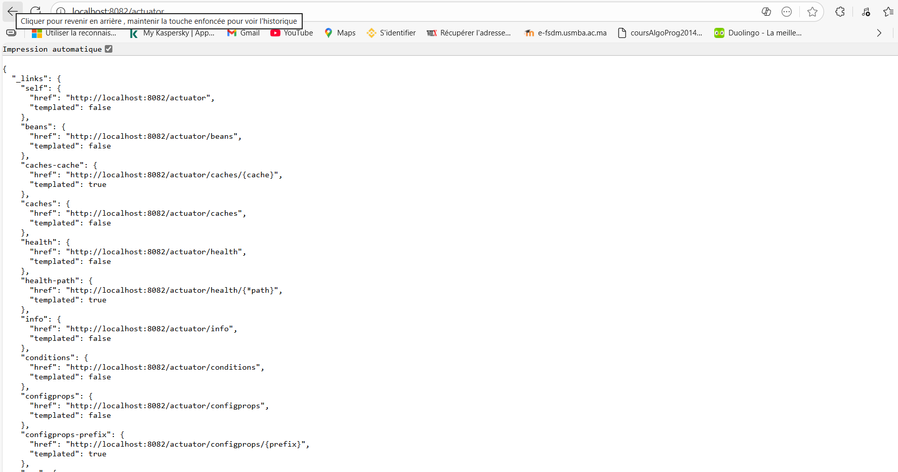
- 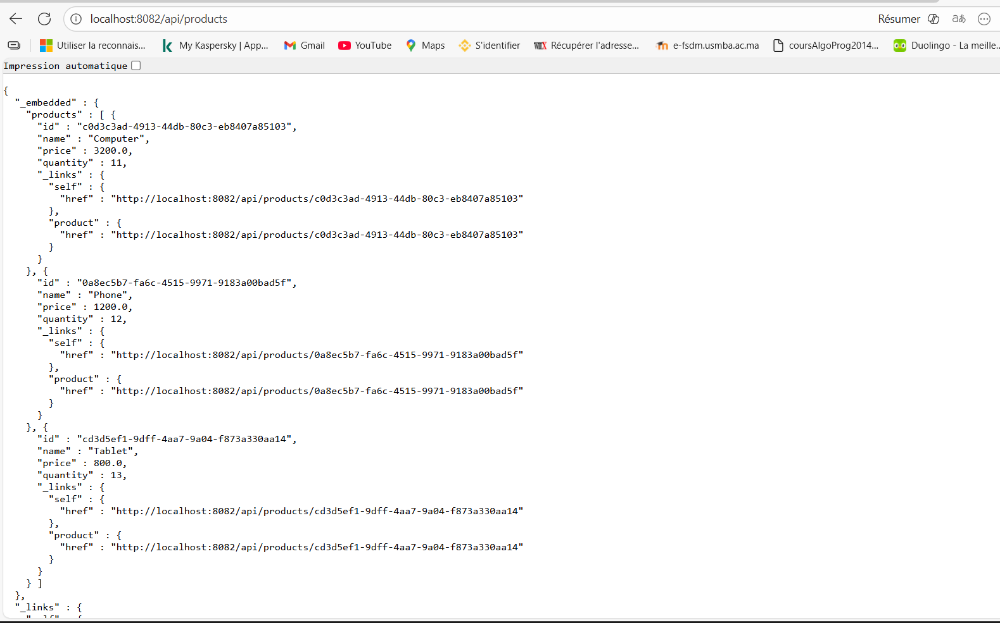

### 3. Création de la Gateway Spring Cloud Gateway
**Objectif :** Implémenter une passerelle API avec routage statique.

**Fonctionnalités implémentées :**
- Routage statique vers customer-service et inventory-service
- Configuration dans application.yml
- Gestion centralisée des requêtes

**Captures d'écran :**
- 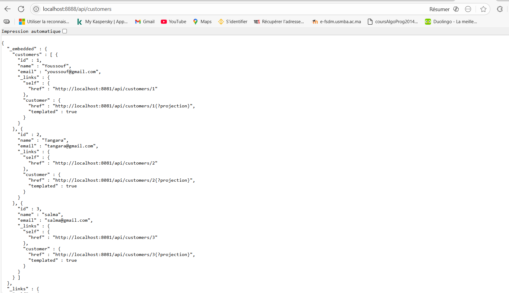
- 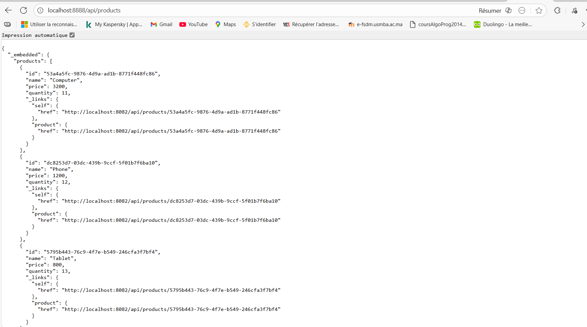

### 4. Configuration statique du système de routage
**Objectif :** Configurer le routage statique dans la gateway.

**Détails :**
- Routes définies dans `application.yml` du gateway-service
- Routage basé sur les chemins d'URL
- Configuration fixe non modifiable à runtime

### 5. Créer l'annuaire Eureka Discovery Service
**Objectif :** Implémenter un service de découverte automatique des microservices.

**Fonctionnalités implémentées :**
- Enregistrement automatique des services
- Découverte dynamique des instances
- Interface web Eureka pour visualisation

**Captures d'écran :**
- 

### 6. Faire une configuration dynamique des routes de la gateway
**Objectif :** Remplacer le routage statique par un routage dynamique via Eureka.

**Fonctionnalités implémentées :**
- Découverte automatique des services via Eureka
- Routage dynamique basé sur les noms de service
- Configuration centralisée

**Captures d'écran :**
- 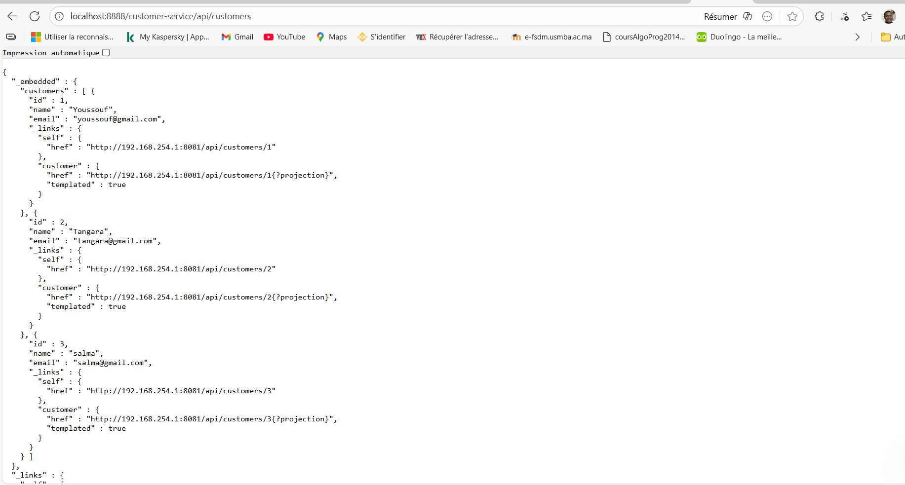

### 7. Créer le service de facturation Billing-Service en utilisant Open Feign
**Objectif :** Développer le service de facturation avec communication inter-services.

**Fonctionnalités implémentées :**
- Création et gestion des factures
- Intégration avec customer-service via OpenFeign
- Intégration avec inventory-service via OpenFeign
- Gestion des ProductItem (lignes de facture)
- Base de données H2 avec données de test

**Captures d'écran :**
- 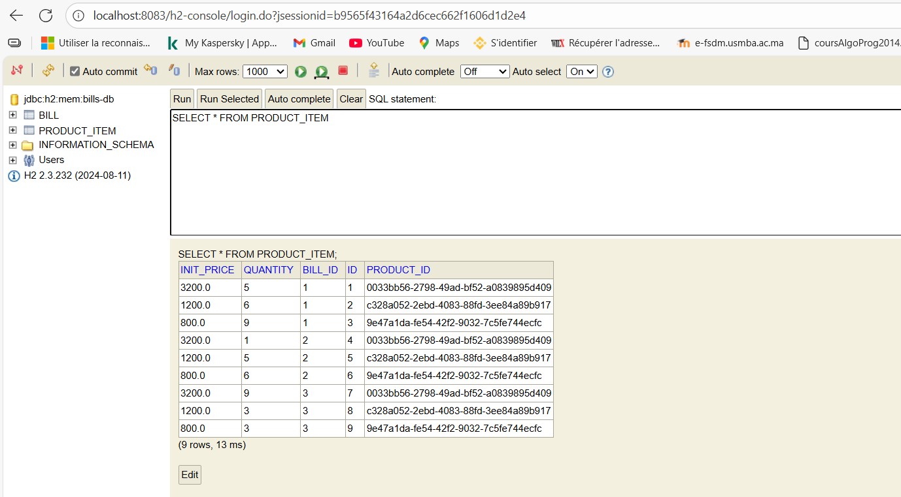
- 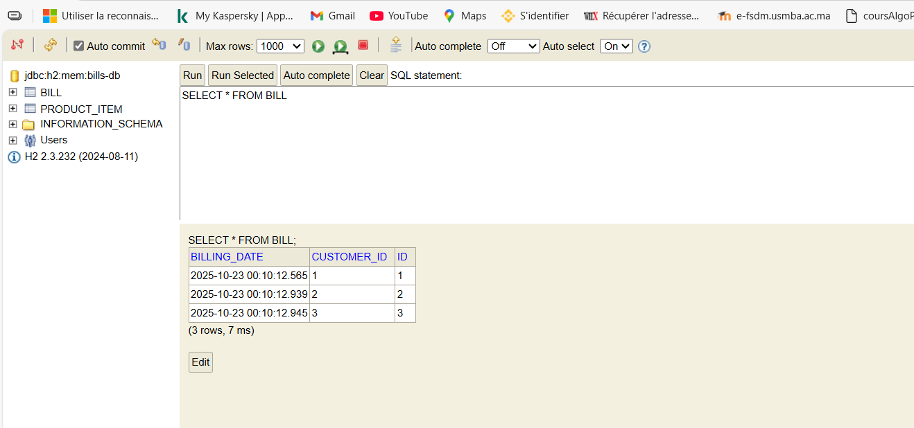
- 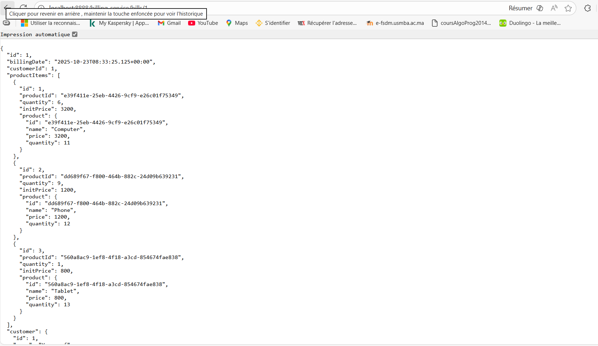

### 8. Créer le service de configuration
**Objectif :** Implémenter un service de configuration centralisée avec Spring Cloud Config.

**Fonctionnalités implémentées :**
- Configuration externalisée dans un repository Git
- Gestion des profils (dev, prod, default)
- Rechargement à chaud des configurations
- Intégration avec les autres microservices

**Captures d'écran :**
- 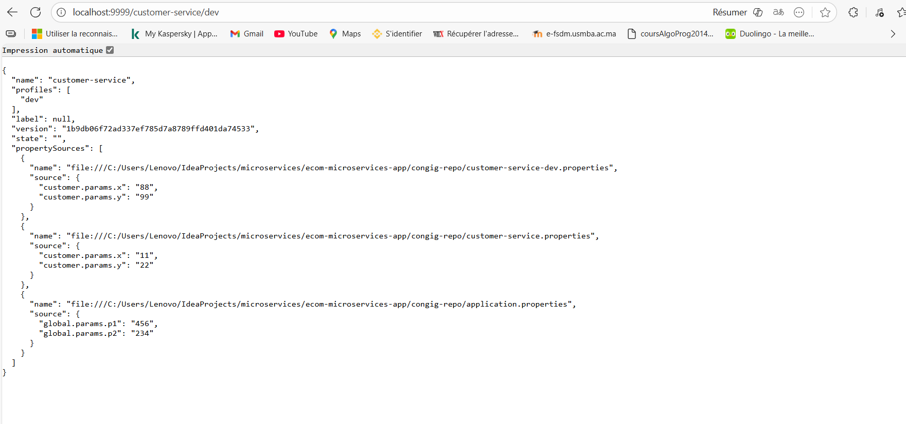
- 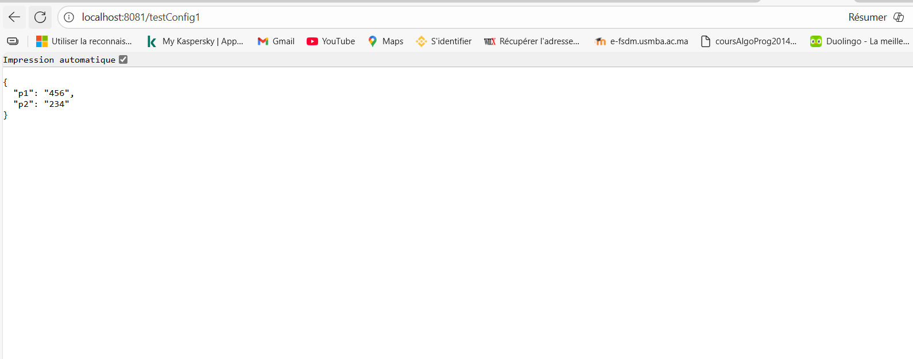
- 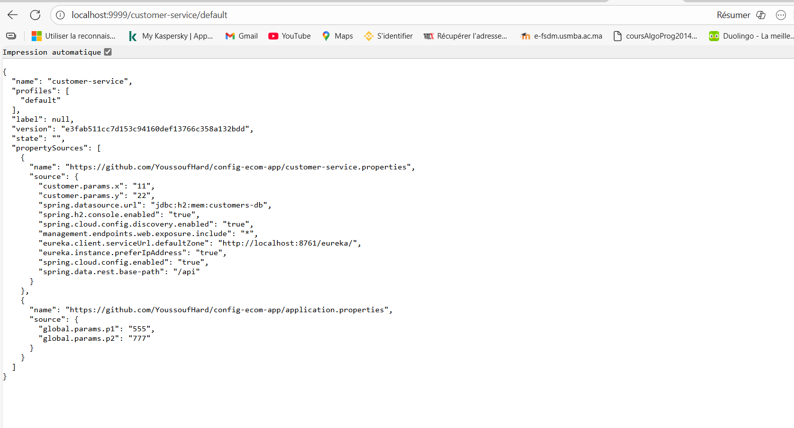
- 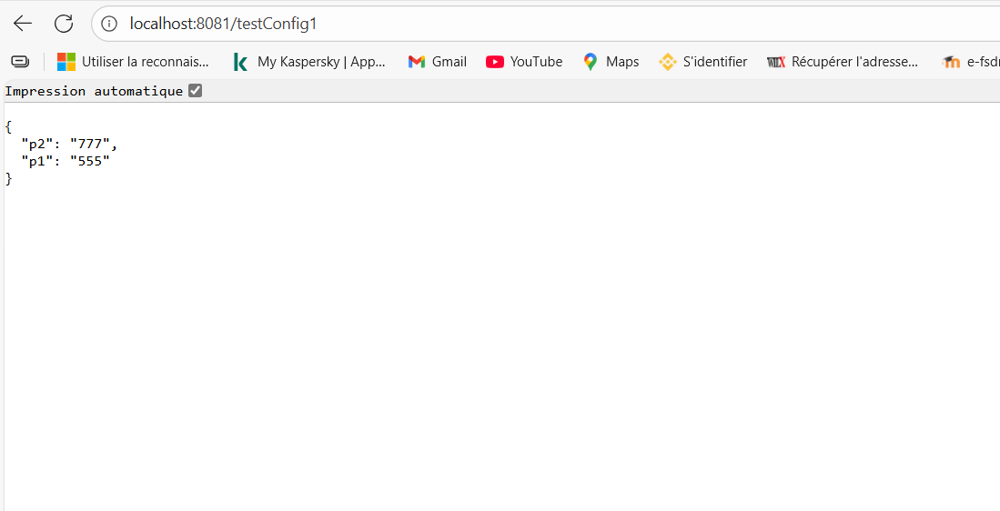
- 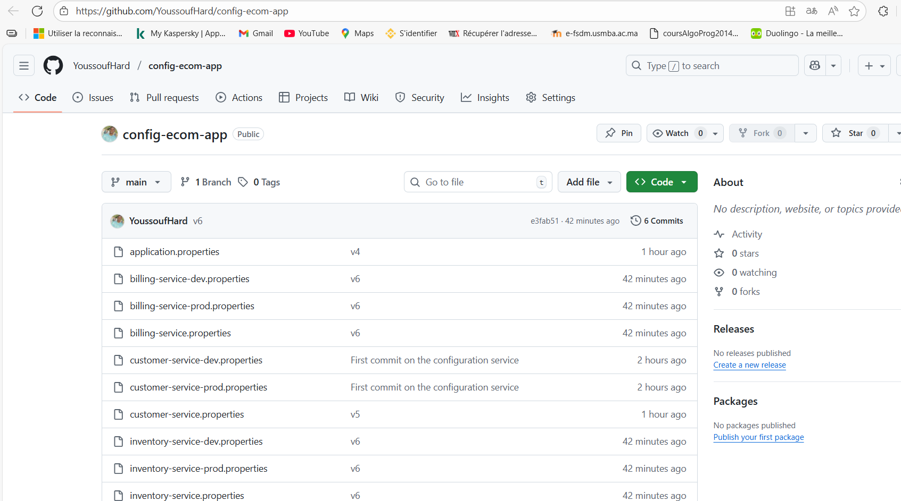

## 🔧 Configuration des Services

### Variables d'Environnement
Chaque service peut être configuré via les fichiers dans `congig-repo/` :
- `application.properties` : Configuration globale
- `{service}-dev.properties` : Configuration développement
- `{service}-prod.properties` : Configuration production

### Configuration Centrale
- Repository Git : `congig-repo/`
- Service de config : Port 8888
- Rechargement à chaud via Actuator

## 🤝 Contribution
1. Forkez le projet
2. Créez une branche pour votre fonctionnalité (`git checkout -b feature/AmazingFeature`)
3. Committez vos changements (`git commit -m 'Add some AmazingFeature'`)
4. Pushez vers la branche (`git push origin feature/AmazingFeature`)
5. Ouvrez une Pull Request

## 📝 Licence
Ce projet est sous licence MIT .
## 📞 Contact
Tangara Youssouf - [ytangara2003@gmail.com](mailto:ytangara2003@gmail.com)

Lien du projet : [https://github.com/YoussoufHard/ecom-microservices-app](https://github.com/YoussoufHard/ecom-microservices-app)

---
Développé avec ❤️ par [Youssouf Tangara](https://github.com/YoussoufHard)

## 📁 Structure du Projet
```
ecom-microservices-app/
├── config-service/          # Service de configuration
├── discovery-service/       # Eureka Discovery Service
├── customer-service/        # Service clients
├── inventory-service/       # Service produits
├── billing-service/         # Service facturation
├── gateway-service/         # API Gateway
├── congig-repo/            # Repository de configuration
├── captures/               # Captures d'écran du projet
├── pom.xml                 # Configuration Maven parent
└── README.md               # Documentation
```
